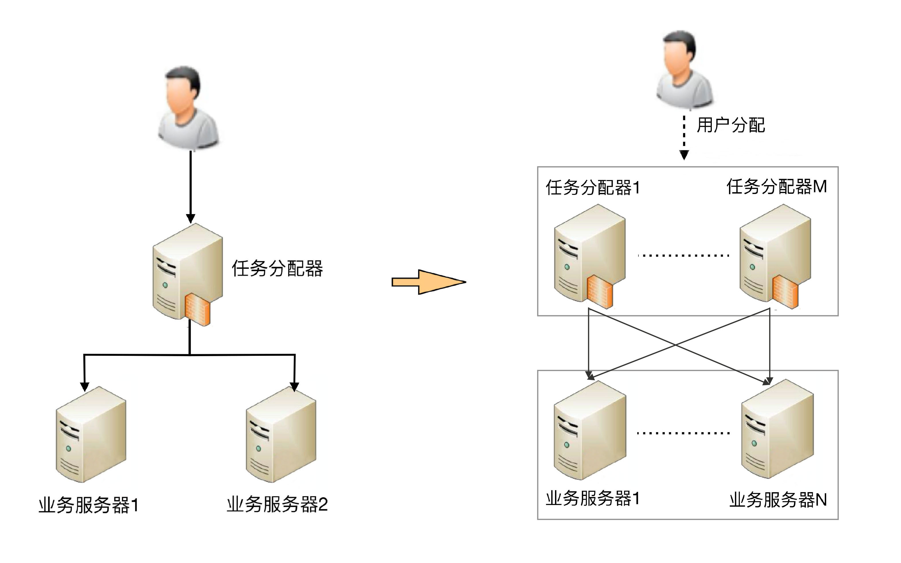
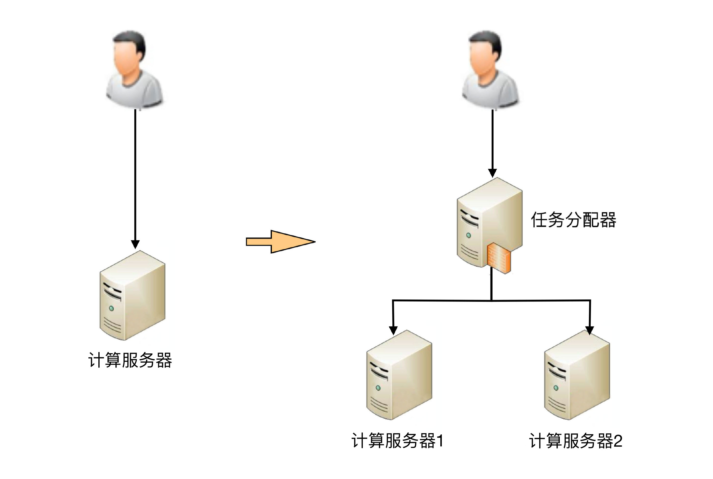
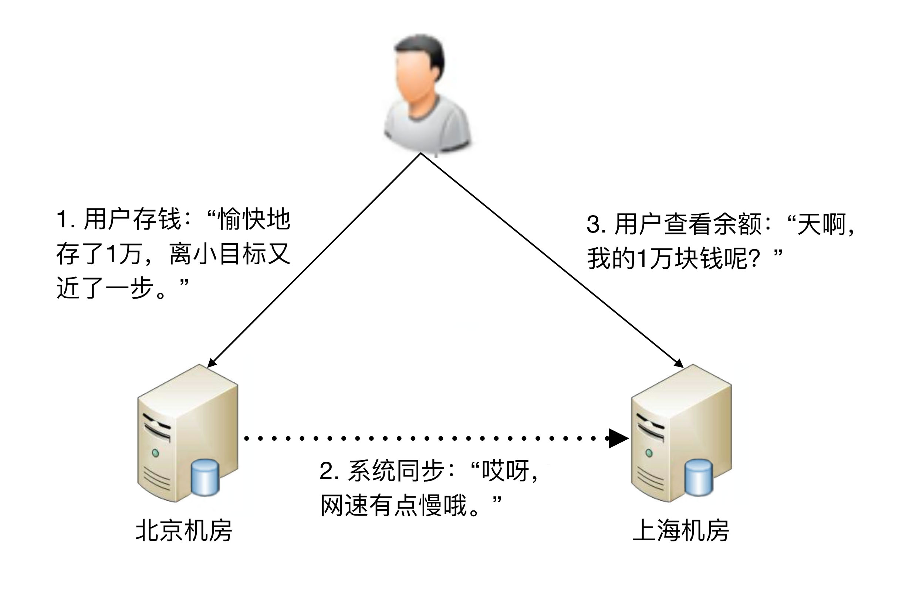
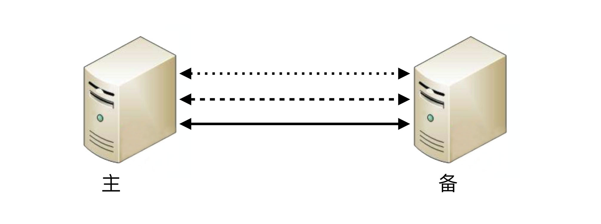
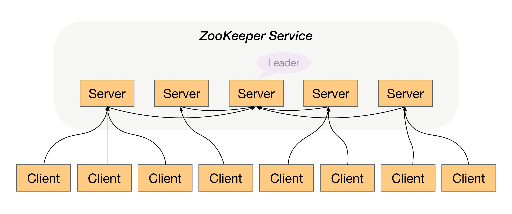

# architecture 架构

## 架构到底是指什么?
* 架构是顶层设计
* 框架是编程或者配置的半成品，比如Spring
* 系统是相互协同独立可运行的实体，比如微信
* 子系统是系统的观察视角，比如朋友圈是微信的子系统
* 组件是从技术维度上可以复用的，比如mysql
* 模块是从业务维度上职责的划分，比如微信朋友圈的点赞模块

## 架构设计的目的
* 架构是应对软件系统的复杂度提出的一种解决方案
* 架构即(重要)决策，比如在一个有约束的盒子里去求解或接近最合适的解
* 需求驱动架构，架起需求分析与设计实现的桥梁
* 架构与开发成本，研发前期修改比较容易，后期修改代价则较大

## 复杂度来源
* 高性能
    * 单台计算机内部为了高性能带来的复杂度
        * 进程，线程
            * 最早计算机等待用户输入指令，低效
            * 为了解决低效问题，批处理操作系统应运而生，把执行的指令预先写下来，只能执行一个任务
            * 进一步提升，出现了进程，cpu还是一个，采取分时的方式
            * 两个任务需要通信只能依靠存储，为了解决这个问题，进程通信的方式被设计出来
            * 单进程内部只能串行执行，为了解决这个问题，多线程出来了
            * 系统本质还是分时系统，因此多个CPU同时处理任务出来了，目前有如下三种解决
        * 处理器
            * SMP 对称多处理器结构
            * NUMA 非一直存储访问结构
            * MPP 海量并行处理结构
        * 并不是最新的就是最好的，也不是非此即彼的选择
    * 集群的复杂度
        * 任务分配
            * 
        * 任务分解
            * 简单的系统更加容易做到高性能
            * 可以针对单个任务进行扩展
* 高可用
    * 计算高可用
        * 
        * 无论在哪台机器上进行计算，同样的算法和输入数据，产出的结果都是一样的
        * 需要增加一个任务分配器
        * 任务分配器和真正的业务服务器之间有连接和交互
        * 任务分配器需要增加分配算法。例如，常见的双机算法有主备、主主，主备方案又可以细分为冷备、温备、热备
    * 存储高可用
        * 
        * 存储与计算相比，有一个本质上的区别：将数据从一台机器搬到到另一台机器，需要经过线路进行传输
        * 存储高可用的难点不在于如何备份数据，而在于如何减少或者规避数据不一致对业务造成的影响
    * 高可用状态决策
        * 无论是计算高可用还是存储高可用，其基础都是“状态决策”
            * 系统需要能够判断当前的状态是正常还是异常，如果出现了异常就要采取行动来保证高可用
            * 如果状态决策本身都是有错误或者有偏差的，那么后续的任何行动和处理无论多么完美也都没有意义和价值
            * 通过冗余来实现的高可用系统，状态决策本质上就不可能做到完全正确
        * 常见的决策方式
            * 独裁式 
            * 协商式 
            * 民主式 
    * 高性能和高可用哪个会更复杂一些 ? 
        * 站不同维度看复杂度
        * 高可用要复杂一些，因为需要考虑的情景很多，而且没有完美的方案，只能做取舍
* 可扩展性
    * 正确预测变化、完美封装变化
    * 预测变化
        * 不断有新的需求需要实现
    * 应对变化
        * 将“变化”封装在一个“变化层”，将不变的部分封装在一个独立的“稳定层”。
        * 提炼出一个“抽象层”和一个“实现层”
* 成本
* 安全
* 规模

## 架构设计三原则
* 合适,合适优于业界领先
* 简单,简单优于复杂
* 演化,演化优于一步到位
    * 对于建筑来说，永恒是主题；而对于软件来说，变化才是主题

## 架构设计流程
* 识别复杂度
    * 排查法,我们大数据平台监控
    * 是否需要高性能，不需要
    * 是否需要高可用性，需要，一旦监控本身挂了会监控失效
    * 是否需要高可扩展性，需要，要接入不同组件的监控
* 设计备选方案
    * 备选方案的数量以3~5个为最佳
    * 备选方案的差异要比较明显
    * 备选方案的技术不要只局限于已经熟悉的技术
    * 实战，大数据平台监控
        * 备选方案1：采用python
        * 备选方案2：采用shell
        * 备选方案3：自研Java prometheus exporter
        
* 评估和选择备选方案
    * 360度环评，列出我们需要关注的质量属性点，然后分别从这些质量属性的维度去评估每个方案，再综合挑选合适当前空开的最优方案
    * 按优先级选择

* 详细方案设计

## CAP、ACID、BASE
* CAP理论
    * 在一个分布式系统中(互联并共享数据的集合)，当涉及读写操作时，只能保证一致性，可用性，分区容错性3者中的2个
    * 一致性（Consistency），对于客户端来说需要读取到最新写入的数据
    * 可用性（Availability），非故障的节点能返回一个合理的值（不是错误或者超时）
    * 分区容错性（Partition Tolerance），即发生了分区现象，不管是什么原因，可能是丢包，也可能是连接中断，还可能是拥塞，只要导致了网络分区，系统能继续干活
* CAP应用
    * 因为网络本身无法100%可靠，所以分区是一个必然现象
    * CA
        * 不成立
        * 当发生分区问题时，为了保证一致性，需要禁止写入，但这样又违背了可用性
    * CP
        * 
        * N1数据已经是y
        * 发生分区问题，N1的数据y并没有复制到N2节点
        * 客户端访问N2，N2应该返回Error，它是怎么知道要返回Error的呢？
    * AP
        * 
        * 客户端访问N2，N2应该返回旧值x，而不是异常或者超时
* CAP详解