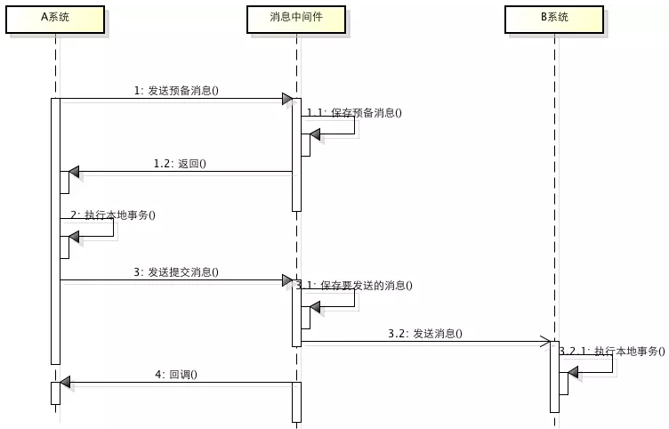

# MQ事务消息

## 理论知识
* 通过MQ消息最终一致性，将本地消息表封装到了MQ中
* 对比本地消息表实现方案不需要再建本地消息表，消息传递不依赖本地数据库事务了，所以这种方案更适用于高并发的场景
* 

### 1、启动RocketMQ
* 下载地址，建议与我一样4.5.0  https://rocketmq.apache.org/zh/download/
* 编写脚本 start_rocketmq.bat，此处找ChatGPT帮忙写的，哈哈
```shell script
@echo off
REM 设置ROCKETMQ_HOME
set ROCKETMQ_HOME=F:\javaEnv\rocketmq-all-4.5.0-bin-release

REM 启动nameserver
start "RocketMQ NameServer" "%ROCKETMQ_HOME%\bin\mqnamesrv.cmd"

REM 启动broker
start "RocketMQ Broker" "%ROCKETMQ_HOME%\bin\mqbroker.cmd" -n 127.0.0.1:9876 autoCreateTopicEnable=true
```

### 2、启动dtx_bank1 DtxBank1Application

### 3、启动dtx_bank2 DtxBank2Application

### 4.1 正常转账测试  检查①减10块，加10块
* 账号1执行转账 http://localhost:1111/transfer?accountNo=1&amount=10
* 检查bank1是否扣10块 SELECT * FROM bank1.account_info 
* 检查bank2是否加10块 SELECT * FROM bank2.account_info

### 4.2 正常转账测试，关闭消费者 检查消费者
* bank2 ComsumerMsgListener.onMessage 打断点 
* 账号1执行转账 http://localhost:1111/transfer?accountNo=1&amount=10
* bank2 关掉服务
* bank2 观察数据库，钱已经加好了
* 再次启动bank2 数据库的钱并没有变多，说明幂等生效了，不会重复加钱

### 4.3 bank1 生产端异常转账
* 账号1执行转账 http://localhost:1111/transfer?accountNo=1&amount=4
* 观察bank1 钱并不会扣减

### 4.4 bank2 消费端异常转账
* 账号1执行转账 http://localhost:1111/transfer?accountNo=1&amount=4
* 观察bank2 钱并不会扣减
* bank2 ComsumerMsgListener.onMessage 会被RocketMQ多次调用，通过这样消费端保障最终一致，如果还有异常，人工介入

### 问题总结
* 1、消息重复消费问题，生成全局事务id存储数据库或redis判重解决（幂等解决）
* 2、本地事务与MQ发送的原子问题，通过MQ消息带一个状态信息解决比如0是未提交，1是已提交；或者使用RocketMQ的半消息机制解决
* 3、事务参与方收消息的可靠性问题，如生产者、消费者执行一半挂掉问题
    * 生产者通过 状态检查机制解决，如RocketMQLocalTransactionListener.checkLocalTransaction方法解决
    * 消费者通过 重复消费解决，如果该消息没有被消费成功重复推送该消息