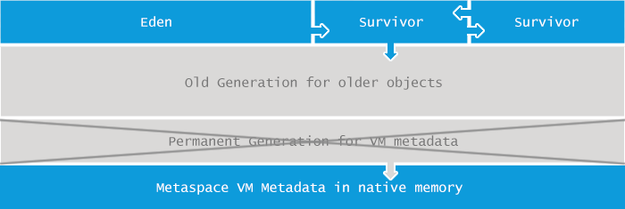

# JVM Java虚拟机

#### JVM内存结构
* JVM体系结构 
    * 类加载子系统
        * 有哪些类加载器?
            ```
                启动类加载器，根加载器
                扩展类加载器
                应用加载器
                自定义加载器
            ```
        * 双亲委机制 
        * 类加载的沙箱机制
    * jdk7 -> jdk8 JVM 
        * http://openjdk.java.net/jeps/122
        * 永久代 -> 元空间
    * 

#### GC的作用域
* 方法区
* 堆

#### 常见的垃圾回收算法
* 引用计数
    * 缺点: 每次对象赋值都要维护引用计数器,有一定消耗
    * 缺点: 较难处理循环引用,(互相引用)
    * JVM实现一般不采用
* 复制
    * MinorGC过程 (复制->清空->互换)
        * eden、SurvivorFrom 复制到SurvivorTo(如果有已经达到老年标准,赋值到老年代),年龄+1
        * 清空eden、SurvivorFrom
        * SurvivorTo和SurvivorFrom 身份互换
    * 优点: 没有产生内存碎片
    * 缺点: 有点浪费空间,大对象复制耗时    
* 标记清除
    * 先标记出要回收的对象,然后统一回收这些对象
    * 优点: 没有大面积去复制,节省空间
    * 缺点: 导致内存碎片
* 标记整理
    * 标记
        * 与标记-清除一样
    * 压缩
        * 再次扫描,并往一端滑动存活对象
        * 没有内存碎片
        * 需要移动对象的成本
* 没有最完美的算法,分代收集        

#### JVM垃圾回收的时候如何确定垃圾? 是否知道什么是GC Roots
* 什么是垃圾: 内存中已经不被使用到的对象
* 如何判断一个对象可以被回收? 
    * 引用计数法(不使用)
    * 枚举根节点做可达性分析(GC Roots)
        * 一系列名为 "GC Roots"的对象作为起始点,能遍历到的(可达的)对象判定为存活,反之判定死亡
        * 虚拟机栈中引用的对象
        * 方法区中的类静态属性引用对象
        * 方法区中常量引用对象
        * 本地方法栈中JNI(Native的方法)引用的对象
        * demo code: com.lcc.jvm.GCRootDemo

#### 你说你做过JVM调优和参数配置,请问如何盘点查看JVM系统默认值
* JVM的参数类型
    * 标配参数 (-version -help)
    * X参数
        * -Xint 解释执行
        * -Xcomp 第一次使用就编译成本地代码
        * -Xmixed 混合模式
    * XX参数
        * Boolean类型
            * -XX:+
            * -XX:-
            * Case 
                ```
                demo code: com.lcc.jvm.HelloGC
                    -XX:+PrintGCDetails
                jps -l
                    5236 com.lcc.jvm.HelloGC
                jinfo -flag PrintGCDetails 5236
                    -XX:+PrintGCDetails
                ```
        * KV设值类型
            * -XX:属性key=属性value
            * Case
                ```
                jinfo -flag MetaspaceSize 5236
                    -XX:MetaspaceSize=21807104  (20MB)
                jinfo -flag MaxTenuringThreshold 5236
                    -XX:MaxTenuringThreshold=15
                    
                demo code: com.lcc.jvm.HelloGC
                    -XX:MetaspaceSize=1G
                    -XX:MaxTenuringThreshold=14
                jps -l
                    4400 com.lcc.jvm.HelloGC
                jinfo -flag MetaspaceSize 4400
                    -XX:MetaspaceSize=1073741824
                jinfo -flag MaxTenuringThreshold 4400   
                    -XX:MaxTenuringThreshold=14
                ```
        * jinfo -flag xxx pid: 该进程一个参数
        * jinfo -flags pid: 该进程所有参数
            * Non-default VM flags: 根据操作系统自身改的一些默认参数
            * Command line: 手动填的一堆参数
        * 两个金典参数-Xms和-Xmx
            * -Xms: 等价于-XX:InitialHeapSize
            * -Xmx: 等价于-XX:MaxHeapSize
* 盘点家底查看JVM默认值
   * -XX:PrintFlagsInitial
        * 查看初始默认值
        * java -XX:+PrintFlagsInitials > jvm.init
   * -XX:PrintFlagsFinal
        * 查看修改更新
        * java -XX:+PrintFlagsFinal -version > jvm.final
        * := 代表修改后的值
   * PrintFlagsFinal举例,运行java命令的同时打印出参数: demo code: com.lcc.jvm.HelloGC
   * -XX:+PrintCommandLineFlags: 查看命令行参数,主要用来查看jvm垃圾回收器            
   
#### 你平时工作用过的JVM常用基本配置参数有那些?
* JDK 文档 
    * https://docs.oracle.com/en/java/javase/12/
    * 工具类文档搜索tool
* JDK 1.8基础知识
    * JDK 1.8后将永久代取消了，由元空间取代
      
      
      
    * 永久代与元空间本质区别
        * 永久代使用的是jvm堆内存
        * 元空间使用的是本机物理内存,元空间大小仅受本地内存限制
            * 类的元数据放入native memory
            * 字符串和类的静态变量放入java堆中
            * 加载多少元数据不在受MaxPermSize控制,而是由系统实际可用空间来控制
* 常用参数
    * -Xms 
        * 初始大小内存,默认物理内存1/64
        * 等价于 -XX:InitialHeapSize
    * -Xmx
        * 最大分配内存,默认物理内存1/4
        * 等价于 -XX:MaxHeapSize
    * -Xss
        * 设置单个线程栈的大小,默认512K - 1024K(跟随操作系统)
        * 等价于 -XX:ThreadStackSize
        * 如果为0代表使用默认值
        * 
    * -XX:MetaSpaceSize
        * 设置元空间大小,元空间不在虚拟机中,而是使用本地内存
        * -XX:MetaspaceSize=1024m -XX:+PrintCommandLineFlags -XX:+PrintFlagsInitial -XX:+PrintFlagsFinal
    * 典型案例
        * -Xms128m -Xmx4096m -Xss1024k -XX:MetaspaceSize=1024m -XX:PrintCommandLineFlags -XX:PrintGCDetails -XX:+UseSerialGC
    * --XX:PrintGCDetails
        * GC收集日志信息 demo code: com.lcc.jvm.GCDetailDemo
        * 
        * 
    * -XX:SurvivorRatio
        * 设置新生代 Eden和 S0/S1空间的比例
        * 默认: -XX:SurvivorRatio=8  Eden:S0:S1 =8:1:1
        * 假如: -XX:SurvivorRatio=4  Eden:S0:S1 =4:1:1
        * SurvivorRatio值为多少eden占比多少,SO,S1一样
        *  -Xms10m -Xmx10m -XX:+PrintGCDetails -XX:SurvivorRatio=8 -XX:+UseSerialGC
    * -XX:NewRatio
        * 配置新生代与老年代堆占比
        * 默认: -XX:NewRatio=2 新生代1,老年代2 年轻代占1/3
        * 假如: -XX:NewRatio=5 新生代1,老年代5 年轻代占1/6
    * -XX:MaxTenuringThreshold
        * 默认进入老年代年龄 15
        * 设置为0,年轻代对象不经过Survivor区,直接进入老年代 对于老年代比较多的应用可以提高效率
        * 设置超过15会报错: must be between 0 and 15
        
       
#### 强引用、软引用、弱引用、虚引用分别是什么?

#### 请谈谈你对OOM的认识

#### GC垃圾回收算法和垃圾收集器的关系? 分别是什么请你谈谈

#### 怎么查看服务器默认的垃圾收集器是那个? 生产上如何配置垃圾收集器的? 谈谈你对垃圾好机器的理解?

#### G1垃圾收集器

#### 生成环境服务器变慢,诊断思路和性能评估谈谈?

#### 假如生成环境出现CPU占用过高,请谈谈你的分析思路和定位

 

