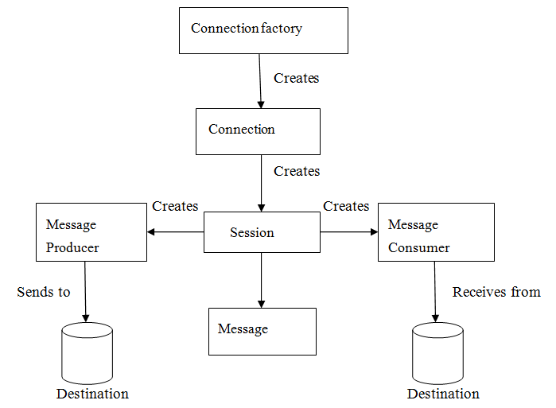

# ActiveMQ 消息中间件

#### 为什么要引入消息中间件?
* 不使用消息中间件现有系统有那些问题
    * 举例订单系统
    * 客户一个下单需要关联很多下游系统,如仓储,物流,支付.. 如果加一个积分系统,需要修改代码去调用(耦合)
    * 如一个订单系统承受压力是100/tps，这时来了1千个请求怎么办,阻塞等待?系统的性能犹如木桶原理取决于最用时最长的子系统(同步,性能)
* 使用消息中间件后有什么改善
    * 加了积分系统,去订阅消息就行,无需改代码
    * 将比较耗时的操作丢给消息中间件,缓解系统压力
    * 系统可以更快响应用户请求

#### 谈谈消息中间件的定义和作用
* 定义
    * 
    * ConnectionFactory: 链接工厂
    * Destination: 目的地
    * Connection: 链接
    * Session: 会话
    * Producer: 消息生产者
    * Consumer: 消息消费者
    * Message: 消息
* 作用
    * 解耦
    * 削峰
    * 异步

