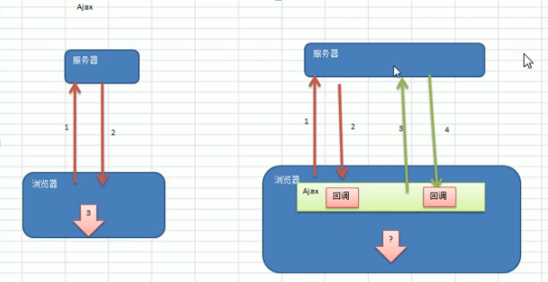
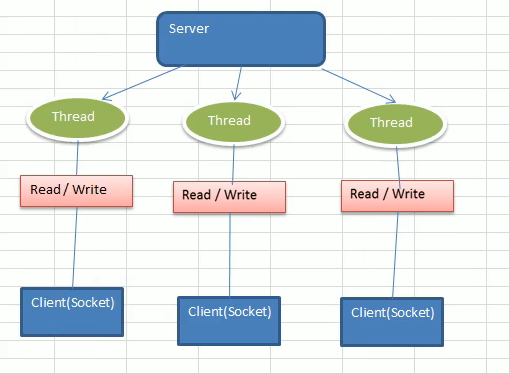
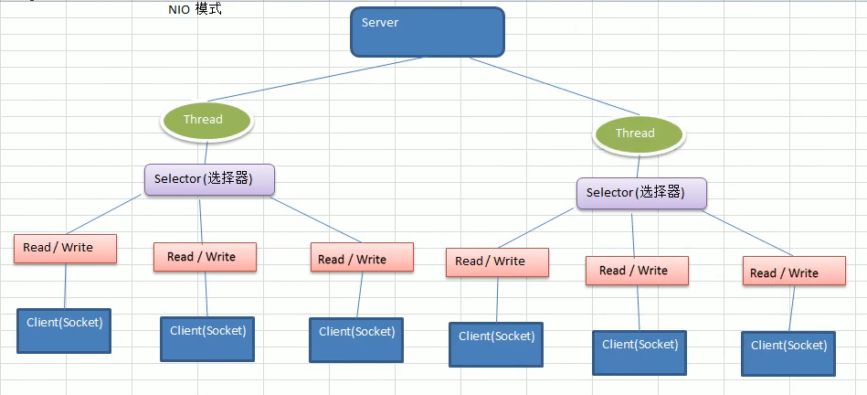
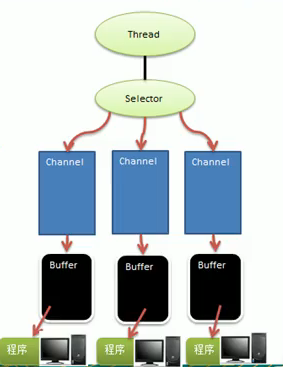

# Netty

## 第一章: Netty介绍和应用场景
* JBoss提供Java开源框架,现GitHub独立项目
* 是一个异步,基于事件驱动的网络应用框架 
  
* 主要针对TCP协议下,面向Client端的高并发应用,或大量数据传输的应用
* Netty本质是一个NIO框架,要透彻理解Netty先学习Nio,这样我们才能阅读Netty源码

## 第二章: I/O模型
* IO模型简单理解,用什么样的通道进行数据的发送/接收,很大程度上决定了程序通信的性能
* Java支持3种网络IO模型,BIO、NIO、AIO
* Java BIO: 
    * 同步阻塞,服务端一个连接一个线程.客户端有一个连接服务端就启动一个线程进行处理,如果这个连接不做任何事情会造成不必要的线程开销
    * 场景: 连接数较小且固定架构,JDK1.4前唯一的选择,但程序简单易理解
    * 
* Java NIO: 
    * 同步非阻塞,服务端一个线程处理多个连接,客户端多个连接会请求注册到多路复用器上,多路复用器轮询连接有事件就进行处理
    * 场景: 连接数较多、连接时间比较短,编程比较复杂,JDK1.4开始支持,如聊天服务器、弹幕系统
    * 
* Java AIO: 
    * 异步非阻塞,引入异步通道概念,采用Proactor模式,简化了程序编写.有效的请求才启动线程,
      特点是先由操作系统完成后才通知服务端程序进行处理,一般适合连接数较多且连接时间较长的应用
    * 场景: 连接数较多、连接时间比较长,编程比较复杂,JDK7开始支持,如相册服务器

## Java NIO编程
* Java Nio基本介绍
    * 全称java non-blocking IO,从JDK1.4开始提供一系列改进输入/输出的新特性,被称为NIO(New IO),是同步非阻塞的
    * NIO相关类都放在 java.nio包下,并且对原java.io 包中很多类进行改写
    * 三大核心部分: Selector(选择器)、Channel(通道)、Buffer(缓冲区)
    * NIO是面向缓冲区,面向块编程的
    * NIO是事件驱动的
    * 通俗理解: 假设10000个请求,可以分配50或者100个线程来处理. 不像BIO得分配10000个线程进行处理
* NIO和BIO比较
    * 一句话,NIO比BIO好很多
    * BIO以流的方式处理数据,NIO以块的方式处理. 块(I/O)效率比流(I/O)效率高
    * BIO是阻塞的,NIO是非阻塞的
    * BIO是通过字节流、字符流进行操作. NIO是通过Channel、Buffer进行操作,数据总是从Channel读取到Buffer或Buffer写到Channel中.
      Selector用于监听多个通道的事件(连接、访问、读取、写入),因此单线程可以监听多个客户端Channel
* NIO Selector、Channel、Buffer三大组件核心原理
    * 
    * Selector对应一个线程,一个线程对应多个Channel,该图有3个Channel注册到Selector
    * Selector会根据不同Event(事件)在各个Channel上切换
    * Channel对应一个Buffer,Channel是双向的,可以返回操作系统情况,比如Linux的通道就是双向的
    * Buffer是一个内存块,底层是一个数组.Buffer是双向的(可以通过flip方法切换读写),BIO要么是输入流要么是输出流,不能双向
* Buffer 缓冲区
    * 是一个可以读写的内存块,容器对象(数组)
    * Buffer类及其子类(抽象类)
       * IntBuffer
       * FloatBuffer
       * CharBuffer
       * DoubleBuffer
       * ShortBuffer
       * LongBuffer
       * ByteBuffer 最常用
    * Buffer四个属性debug走一圈 com.lcc.nio.TestBuffer mark <= position <= limit <= capacity
* Channel 通道