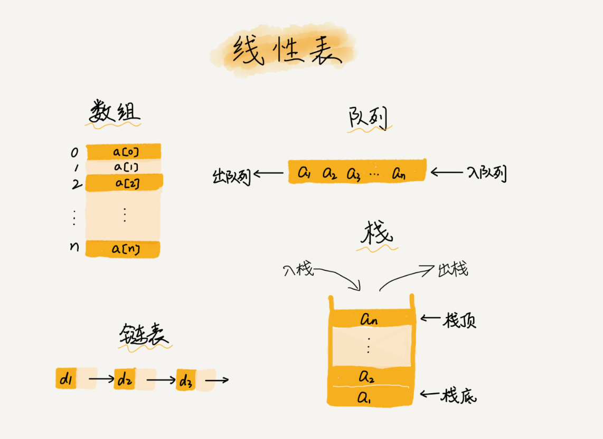

# 数据结构

## 为什么很多编程语言中数组都是从0开始编号？
* 如何实现随机访问?
    * 数组是一种线性表数据结构。它用一组连续的内存空间来存储相同类型的数据
        * 线性表
            * 
            * 线性表就是数据排成像线一样的结构，每个线性表只有前后两个方向。除了数组，像栈、队列、链表也是线性结构
        * 非线性表
            * 
            * 与之对应的就是非线性表，如二叉树，图，堆。数据之间并不只是简单的前后关系
        * 正是因为这两个特性，它才有了一个杀手锏特性"随机访问"
        * 如何实现根据下标随机访问？
            * 
            * 数组 int[] a = new int[10];
            * 分配了一块连续内存空间 1000～1039
            * 内存块的首地址为 base_address = 1000
            * int占用4个字节 a[i]_address = base_address + type_size * i
* 低效的"插入"和"删除"
    * 如果需要将一个数据插入到地k个位置，时间复杂度是多少?
        * 如果是插入到首位，复杂度为O(n)
        * 如果插入到末尾时间复杂度为O(1)
        * 如果插入到其他地方平均时间复杂度为O(n)
        * 假设数组 a[10]中存储了如下 5 个元素：a，b，c，d，e    
            * 
            * 我们现在需要将元素 x 插入到第 3 个位置
            * 我们只需要将 c 放入到 a[5]，将 a[2]赋值为 x 即可
            * 这种处理技巧，在特定场景下，在第 k 个位置插入一个元素的时间复杂度就会降为 O(1)
    * 如果我们要删除第 k 个位置的数据，时间复杂度是多少?
        * 和插入时间复杂度一样，平均时间复杂度为O(n)
        * 在某些特殊场景下，我们并不一定非得追求数组中数据的连续性。如果我们将多次删除操作集中在一起执行，删除的效率是不是会提高很多呢？
            * 
            * 数组 a[10]中存储了 8 个元素：a，b，c，d，e，f，g，h
            * 现在，我们要依次删除 a，b，c 三个元素
            * 为了避免 d，e，f，g，h 这几个数据会被搬移三次，我们可以先记录下已经删除的数据
            * 当数组没有更多空间存储数据时，我们再触发执行一次真正的删除操作，这样就大大减少了删除操作导致的数据搬移
            * 这不就是JVM标记清除垃圾回收算法的核心思想吗?
* 容器能否完全替代数组？
    * 容器特点
        * ArrayList 最大的优势就是可以将很多数组操作的细节封装起来
        * 支持动态扩容，每次存储空间不够的时候，它都会将空间自动扩容为 1.5 倍大小
        * 如果事先能确定需要存储的数据大小，最好在创建 ArrayList 的时候事先指定数据大小
    * Java ArrayList 无法存储基本类型，封箱拆箱有一定性能消耗，如果特别关注性能，可以用数组
    * 对数据大小预先已知，并且对数据操作非常简单，也可以用数组
    * 业务开发用容器够了，省时省力，损耗一点性能完全不影响系统整体性能。但如果是非常底层的开发，如网络框架，这时候数组优于容器
* 为什么大多数编程语言中，数组要从0开始编号，而不是从1开始呢？
    * 内存模型来看，计算内存地址，从0开始
        * a[k]_address = base_address + k * type_size
    * 但如果从1开始，多了k-1的计算 多一次减法指令
        * a[k]_address = base_address + (k-1)*type_size
    * C语言设计者用0开始计数数组下标，之后的Java、JavaScript等高级语言都效仿了C语言，或者说为了在一定程度上减少C语言程序员学习Java的学习成本，因此继续沿用了从0开始计数的习惯。
    